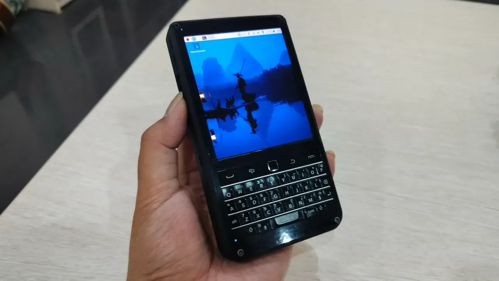

# piBrick
**piBrick** is Open Source Hardware project(s).

## [piBrick Pocket-CM5](Pocket-CM5/README.md)
**piBrick Pocket-CM5** is a smartphone-sized handheld PC powered by the **Raspberry Pi CM5**, featuring a 3.91" AMOLED touch display and a QWERTY keyboard+trackpad from **BBQ20**.
